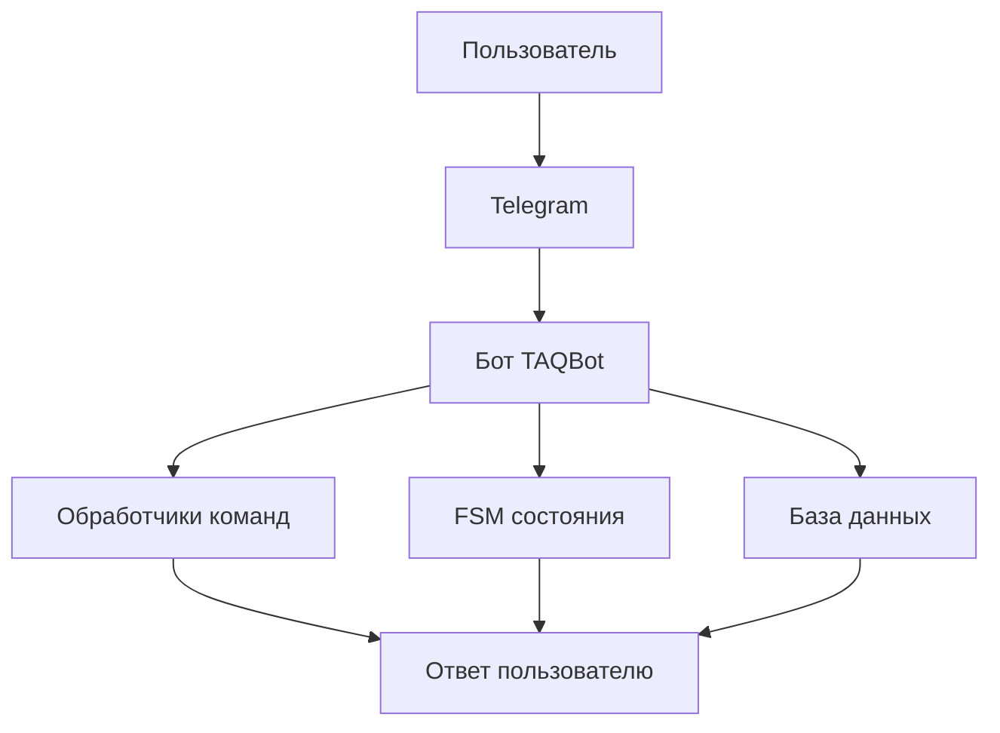
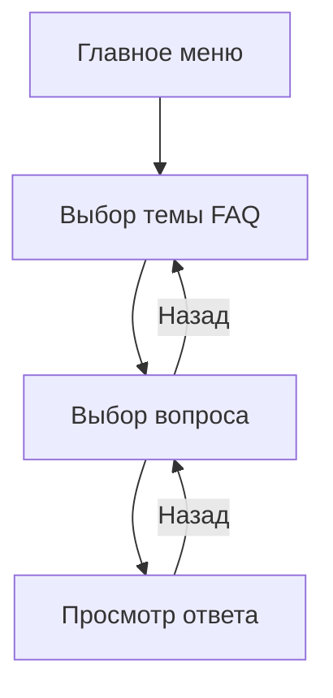
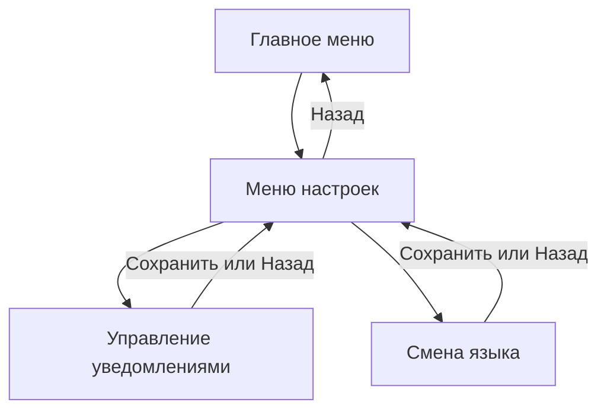
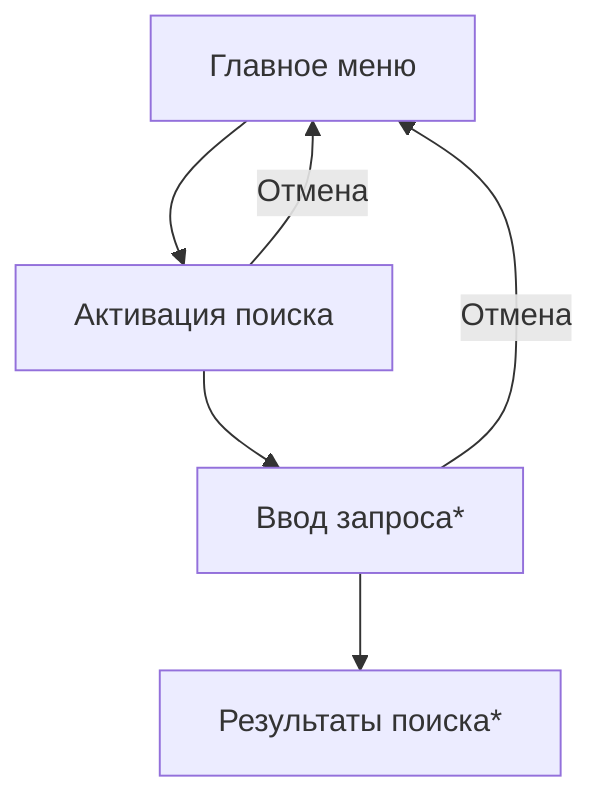

# TAQBot - Telegram Answers to Questions Bot

Чат-бот для ответов на вопросы с системой FAQ, поиском и настройками пользователя.

## Задачи проекта

- [x] Создать интерфейс чат-бота при помощи библиотек на Python.
- [x] Описать процессы чат-бота в виде схем.
- [x] Описать каждый элемент процесса на Python.

## Основные функции

- Многоуровневая система FAQ (темы -> вопросы -> ответы)
- Поиск по базе знаний
- Настройки пользователя (уведомления, язык интерфейса)

## Технический стек

- Python 3.12.7
- aiogram 3
- python-dotenv
- JSON

## Схемы процессов

Обозначения:
- \* \- не реализованно

### 1. Общая архитектура бота



### 2. Процесс работы с FAQ



### 3. Процесс настроек



### 4. Процесс поиска



## Установка и запуск

1. Склонировать репозиторий:

```bash
git clone https://github.com/NicoNightL/TAQBot.git
```

2. Установить зависимости:

```bash
pip install -r requirements.txt
```

3. Создать файл .env:

```bash
TOKEN=ваш_токен_бота
```

4. Запустить бота:

```bash
python run.py
```

## Структура проекта

```
TAQBot/
├── app/
│   ├── database.json  # База вопросов
│   ├── database.py    # Работа с данными
│   ├── handlers.py    # Обработчики сообщений
│   └── keyboards.py   # Клавиатуры бота
├── .env               # Переменные окружения
├── config.py          # Конфигурация
├── README.md          # Документация
├── requirements.txt   # Зависимости
└── run.py             # Точка входа
```
